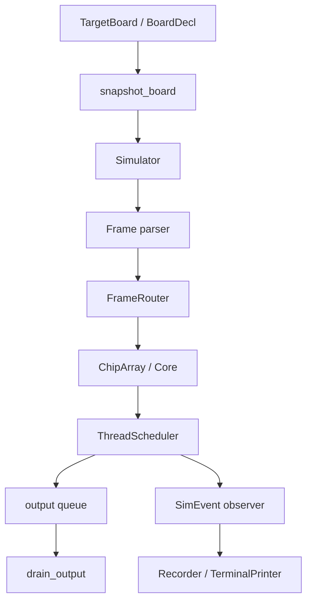

# PAISim 对象与执行设计

状态：当前架构说明；不等同于完整阶段 3 实现承诺。

这份文档面向需要阅读或修改 PAISim 的开发者。板卡声明和 `FrameRouter` 不再拆成两份
小文档，因为它们只有放在同一条执行链中才容易理解。面向用户的操作示例和功能边界见
[用户指南](user-guide.md)。

## 执行链总图



板卡模块回答“哪些芯片和端口存在，以及哪些 X/Y 边可以跨片路由”；帧路由模块回答“这
个协议词当前要到哪个内部核或声明的外部端口”；调度器回答“线程何时完成一个逻辑步”。
它们共享同一个运行态，但不互相代替。

## 硬件与板级边界

- `博士后研究报告_钟毅.pdf` 正文第 97 页：X/Y 边界九个核的数据通道经过
  9→3 合并分发，而 `sync_all`、`initial_all`、`busy`、`done` 各只合并为一路。
- `T4原理图.pdf` 第 6–7 页：每个板级方向有三组数据通道，但只有一组
  `SYNC/INIT/DONE/BUSY` 引脚。

PAISim 是功能仿真器，因此数据路由保留源、目标和顺序，不模拟 lane、MUX/DEMUX、
仲裁或物理周期。跨片全局信号按 `9 -> 1 -> 9` 建模：输出边界九核共享一条无标签
`SignalLink`，输入端九核都看到该方向信号，再由各核 `global_receive` 位决定是否接入
本核控制路径。SignalLink 只描述物理连接，不保存 ThreadId 所有权；信号可传播到其他
线程的核。编译器负责避免错误配置，仿真器不依据线程归属主动拦截硬件传播。

实物 `array2x2`（硬件资料中称 T4）为四芯片二维 Mesh：`(0,0)`、`(1,0)`、
`(0,1)`、`(1,1)`，只有两条 X 边和两条 Y 边。`single` 无跨片边。用户板卡
可声明更多芯片及显式 X/Y 邻接，但属于抽象功能模型，未经板卡实测核准。片内保留
六方向路由；`XY+`/`XY-` 不得跨芯片，也不会退化成 X+Y 捷径。

## 对象与状态所有权

```text
Simulator
└── ChipArray
    ├── SignalLink[declared edges]
    └── Chip
        ├── CoreThread
        └── OfflineCore | OnlineCore | RelayCore | CompletionCore
            ├── NeuronBank -> Neuron
            ├── Weights
            ├── Lut
            └── input SRAM
```

`TargetBoard` 位于运行态层次之外：`SingleBoard`、`Array2x2Board` 是不可变预设，
用户子类或 `CustomBoard` 可修改声明；`BoardDecl` 只承载输入数据，不在构造时校验。
`snapshot_board()` 在仿真器边界完成复制与校验，并产生每台 `Simulator` 独立的
不可变 `BoardSnapshot`，再实例化自己的芯片和信号边。`ChipCoord`、`CoreCoord` 和
`CoreAddr` 明确区分芯片身份与片内坐标。计算核不通过一个
无行为基类伪装统一性，使用联合类型处理共同操作。`RelayCore` 只传播控制信号，
`CompletionCore` 只作为完成成员，两者都不解码或执行神经元。

SRAM 是唯一权威状态。神经元对象按索引临时创建，是受控的可变视图；setter 和 bank/store
负责范围校验、写回、revision 更新与解码缓存失效。原始 neuron SRAM、LUT 和 weight 数组
只暴露只读视图。离线 full/half/fold 是 `OfflineLayout`，不是三套行为子类。在线神经元有
独立类型，因为其配置和存储语义不同。

## 路由与调度

`FrameRouter` 负责帧位域到显式 `CoreAddr` 的转换、片内移动、板级 X/Y 边跳转和输出口
识别。它不推进线程。`SignalTree` 只处理全局控制连接；片内依方向位连接相邻核，板级连接
交给板卡声明的 `SignalLink`。SignalTree 是物理连接视图，CoreThread 是调度元数据；二者
不以 ThreadId 作为隔离条件。

每个 `CoreThread` 保存 root、独立 tick、SYNC 预算、compute/relay/completion 成员和
busy/done。调度器保持输入事件顺序，并在输入事务之间按稳定 `ThreadId` 轮转 runnable
线程。多个线程可同时 runnable，但不存在芯片级 tick 或全芯片提交屏障。

单线程一步固定为：读取所有成员步前状态，NumPy 批量计算，统一提交，然后投递输出。
成员字典或对象插入顺序不改变该步可见性。在线成员在 SYNC 预检阶段使整个线程失败，
不会先推进其中的离线核。

配置包在完整到达后先验证所有目标，再整体写入；半包不产生写入。WORK 多播同样先验证
全部目标，再统一提交。观察关闭时只更新状态和输出，不建立逐事件 DTO 或历史列表。

Protobuf 模型通过 `Simulator.from_artifact()` 读取。配置帧在完整事务提交后，按元数据解析
线程根；默认 `auto_init=True` 直接复位各线程状态但不把内部 COMPLETE 放入用户输出。模型
视图与原始文件解耦，修改原文件不会改变已创建实例。普通 `Simulator(board)` 仍是可增量
配置的空壳，输入帧不受 INIT 状态约束。若 Protobuf 内容变化，必须重新调用
`Simulator.from_artifact()` 创建新实例；运行中的实例不会回读文件。

## 保真范围

离线数值语义沿用已验证的 NumPy 实现，包括 full/half/fold、dense/CSC、输入环、整数
位宽、SNN 阈值和 ANN LUT。在线核仅实现对象、配置/存储、WORK、TEST、INIT、路由和观察；
SYNC/UPDATE 数值行为明确不支持。

当前不是 NoC 时序或电路仿真：不声称复现 lane 带宽、MUX/DEMUX、争用、流水延迟或真实
墙钟时间。`busy` 表示线程仍有计算预算或逻辑事件，`done` 表示该线程预算已完成；它们按
线程成员汇聚，不是物理引脚波形。
