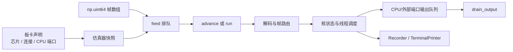

# PAISim 用户指南

本文从一个空的仿真器开始，说明板卡如何声明、协议帧如何进入仿真器、仿真如何推进，以及
如何读取和保存结果。最后再介绍如何直接使用编译器生成的 Protobuf 编译产物。

如果你只想先运行一个最小例子，可以跳到[输入、执行和输出](#3-输入执行和输出)。如果需要
理解协议和内部执行过程，先阅读下面的术语表；更完整的帧事务定义见[运行契约](runtime.md)，
板卡、路由和调度器的对象关系见[架构说明](architecture.md)，事件记录见[观测契约](observability.md)。

## 术语表

| 术语 | 本指南中的含义 |
| --- | --- |
| 协议词 | 一个 `np.uint64` 值，也是仿真器输入输出数组中的一个元素。 |
| 帧 | 由帧头和后续负载词组成的一次协议事务；一个帧可能包含多个协议词。 |
| 帧数组 | 按协议到达顺序排列的一维 `numpy.uint64` 数组。 |
| 帧头 | 协议词中说明事务类型和长度的部分。 |
| 负载词 | 帧头之后携带配置、输入或读回数据的协议词。英文代码和事件类型仍写作 `payload`。 |
| 配置包 `CONFIG` | 向目标核写入寄存器、查找表、神经元/权重存储或输入存储的事务。 |
| 工作输入 `WORK` | 把一个带时间位置、输入地址和数据的输入词写入核的输入环。 |
| 读回请求 `TEST` | 请求核返回配置或存储内容的事务；返回词会进入输出队列。 |
| 初始化 `INIT` | 清理线程输入和动态状态并重置逻辑时间的控制事务。 |
| 同步 `SYNC` | 为线程增加逻辑时间步预算并触发调度的控制事务；`SYNC(0)` 只校验并完成，不推进时间。 |
| 更新 `UPDATE` | 控制运行时更新的协议事务；当前在线核数值执行不支持。 |
| 完成词 `COMPLETE` | 线程预算耗尽后由仿真器生成的结束词，排在该线程普通输出之后。 |
| 数据词 `DATA` / 电压词 `VOLTAGE` | 两类输出数据格式；具体位布局由协议帧格式定义。 |
| 核（core） | 板卡上执行配置、输入处理和状态更新的计算单元。API 中仍使用 `CoreAddr`、`OfflineCore` 等名称。 |
| 线程（thread） | 一组由同一个控制信号树调度的核，以及它们共享的逻辑时间和预算。 |
| 时间步（tick） | 线程完成一次 `read -> compute -> commit -> deliver` 后增加的逻辑时间位置。 |
| 输入端口 / 输出端口 | CPU 或外部设备连接板卡的入口和出口，API 中分别对应 `ingress` 和 `outputs`。 |
| 帧路由器 `FrameRouter` | 根据帧中的路由信息决定下一个内部核或外部端口；不负责线程计算。实现关系见[架构说明的路由与调度部分](architecture.md#路由与调度)。 |
| 调度器 `ThreadScheduler` | 按线程预算推进逻辑时间步，并在预算耗尽时生成 `COMPLETE`；运行顺序见[运行契约的线程语义](runtime.md#线程语义)。 |
| 编译产物 | 编译器生成的配置帧、线程信息和输入输出映射文件；本指南中的 Protobuf/JSON 文件属于这一类。 |

这些词是协议和 API 的固定名称，代码示例会保留原拼写。正文使用“配置包”“负载词”等中文，
只有在说明代码字段或事件类型时才保留对应的英文名称。

## 1. PAISim 模拟什么

PAISim 是 PAICORE 2.5 的确定性功能仿真器。它读取协议帧，按照板卡拓扑进行路由，
更新计算核的配置和状态，调度线程，并把送到 CPU 或外部端口的词放入输出队列。

它与 SystemVerilog 中常见的 RTL 仿真有相似的用途：都可以检查输入驱动下的状态变化和
协议结果。但 PAISim 的执行对象是 Python 中的功能模型，不是门级或周期级电路。它不计算
真实时钟周期、lane 带宽、MUX/DEMUX、仲裁、流水线延迟、信号传播时间或墙钟时间。因此，
仿真结果只说明功能模型的输入输出关系，不能单独证明 RTL 等价、物理时序或真实板卡性能。

用户通常有两种输入来源：

1. 手动构造少量协议帧，用来学习协议或定位某个路由问题。
2. 使用编译器生成的编译产物，把配置帧和每个时间步的输入编码交给仿真器。

## 2. 先声明一块板卡

仿真器不会从输入帧反推板卡。创建 `Simulator` 时必须传入一个板卡声明，输入端也必须是
该声明中的 CPU `Port`。声明的完整校验规则见[运行契约的板卡部分](runtime.md#公共-api)，
对象关系见[架构说明的板卡与状态部分](architecture.md#对象与状态所有权)。

### 预设板卡

使用一块单芯片板卡：

```python
from paisim import ChipCoord, Port, SingleBoard

board = SingleBoard()
cpu = Port(ChipCoord(0, 0))
```

`Array2x2Board()` 提供四个芯片坐标 `(0, 0)`、`(1, 0)`、`(0, 1)`、`(1, 1)`，并显式
声明相邻的 X/Y 连接。预设板卡的端口由板卡声明提供，也可以像上例一样构造对应的
`Port` 值来传给 `feed()`。

### 自定义板卡

自定义板卡必须明确给出芯片、跨芯片连接、输入端口和输出端口。连接只允许已声明芯片间的
单位 X/Y 邻接，仿真器不会自动补边：

```python
from paisim import ChipCoord, CustomBoard, Port, Simulator

a = ChipCoord(0, 0)
b = ChipCoord(1, 0)
board = CustomBoard(
    chips=[a, b],
    links=[(a, b)],
    ingress=[Port(a)],
    outputs=[Port(a), Port(b)],
)

sim = Simulator(board)
cpu = board.declaration.ingress[0]
```

板卡对象只是声明数据。`Simulator` 创建时会复制并校验它，形成自己的板卡快照。之后再
修改 `CustomBoard` 的列表不会改变已经创建的仿真器。

## 3. 输入、执行和输出

仿真器处理一维 `numpy.uint64` 帧数组。帧已经是 PAICORE 协议词；普通 Python 整数、
张量或应用样本不会被 `Simulator` 自动编码。



三个最常用的接口职责不同：

- `feed(words, ingress=port)` 只复制并排队输入，不执行仿真。
- `advance(max_events)` 执行有限数量的输入事务或线程步事件。
- `run(max_events=None)` 继续执行，直到输入和可运行线程都为空，或达到预算。
- `drain_output()` 返回并清空上次 drain 以来的原始输出词。

最短的可运行形态如下。`encoded_words` 应替换成编译器或帧编码器提供的一维数组：

```python
import numpy as np

from paisim import ChipCoord, Port, Simulator, SingleBoard

board = SingleBoard()
cpu = Port(ChipCoord(0, 0))
sim = Simulator(board)

words = np.asarray(encoded_words, dtype=np.uint64)
sim.feed(words, ingress=cpu)
event_count = sim.run()
outputs = sim.drain_output()

print(f"executed events: {event_count}")
print(outputs)
```

`run()` 返回的是执行事件数，不是时间步数或输出词数。没有对外输出时，
`drain_output()` 会返回空的一维 `np.uint64` 数组。

## 4. 手动控制仿真器

手工方式适合检查路由和少量 WORK 输入。公开的帧辅助函数可以构造路由位和 WORK 词：

```python
import numpy as np

from paisim import ChipCoord, Port, Simulator, SingleBoard
from paisim.frames import route_bits, work_word

board = SingleBoard()
cpu = Port(ChipCoord(0, 0))
sim = Simulator(board)

# 六个有符号路由字段：(offset_z, offset_x, offset_y, copies_z, copies_x, copies_y)
route = route_bits((0, 0, 0, 0, 0, 0))
work = work_word(route, slot=0, axon=0, data=1)
sim.feed(np.asarray([work], dtype=np.uint64), ingress=cpu)
sim.run()
print(sim.drain_output())
```

完整配置需要 `CONFIG` 配置包的帧头和负载词。PAISim 会校验并原子提交完整配置包；包可以
跨多次 `feed()` 到达。为了避免用户手写寄存器布局，实际运行建议使用编译器产物中的配置
帧。下面的写法只表示输入形状，`config_words` 必须由编译器或专用帧编码器提供：

```python
config_words = np.asarray(compiler_config_words, dtype=np.uint64)
sim.feed(config_words, ingress=cpu)
sim.run()
```

常见协议阶段包括 CONFIG、TEST、WORK、INIT、SYNC 和 UPDATE。协议词的具体位布局属于
PAICORE 帧格式；运行时会先完成包级校验，再写入目标核。一个半包不会留下半次配置。

## 5. 按时间步观察执行

线程的逻辑时间由 `tick` 表示。`advance(1)` 的单位是一个调度事件，可能只消费一个
帧头、一个负载词或一个输入事务，所以它不保证正好推进一个时间步。只有收到 `step`
事件时，才表示某个线程完成了一个逻辑时间步。

可以把一次运行理解为下面的时间轴：

```text
输入事务        step(tick=0)       step(tick=1)       step(tick=2)
   |                  |                  |                  |
feed -> advance ... -> 输出词 ...       输出词 ...       输出词 ... COMPLETE
```

最后一个线程步会先交付该步的普通计算输出，再把 COMPLETE 追加到输出队列末尾。事件回调
的顺序不同于输出队列顺序：最终步通常是 `core_step`（如果存在）、`complete`、`step`。
因此应读取事件的 `kind`、`sequence` 和 `tick`，不要根据回调到达位置猜测输出队列顺序。
完整的事件字段和回调错误语义见[观测契约](observability.md#事件)。

需要按线程步收集结果时，可以让 `Recorder` 保存进度事件，并在每次 `advance(1)` 返回后
读取这一轮的记录：

```python
from paisim import PortDirection, Recorder, Simulator, TraceFilter, TraceLevel

recorder = Recorder(
    trace_filter=TraceFilter(level=TraceLevel.PROGRESS),
)
sim = Simulator(
    board,
    on_event=recorder,
    trace_filter=recorder.trace_filter,
)
sim.feed(words, ingress=cpu)

while sim.advance(1):
    current = recorder.records
    recorder.clear()
    step = next((event for event in current if event.kind == "step"), None)
    if step is None:
        continue
    outputs = [event for event in current if event.direction is PortDirection.I2E]
    print(f"thread={step.thread} tick={step.tick} words={[e.word for e in outputs]}")
```

没有输出的时间步会得到空列表。正式代码也可以按 `PortDirection.I2E` 过滤其他输出方向。

## 6. 选择观测深度

`Recorder` 保存统一的 `SimEvent` 记录。记录包含 `sequence`、事件类别 `kind`、通信方向、
源核、目标核、端口、交付词 `word`、原始词 `raw_word`、线程和 tick。`word` 是用户应处理
的词；I2E 输出的 `raw_word` 仍保留带路由位的协议词。

如果需要了解事件生成位置、筛选顺序和回调失败后的状态，请参阅[观测契约](observability.md)。

方向名称按端点解释：`E2I` 是外部端口到内部核，`I2I` 是内部核到内部核，`I2E` 是内部
核到外部端口。`frame`、`payload`、`signal`、`core_step`、`step` 和 `complete` 是事件
类别，用来区分事件含义；方向用于筛选通信流向。`step` 和 `core_step` 没有通信方向。

四个 `TraceLevel` 是包含关系，不是四个互相独立的集合：

```text
OUTPUT   = I2E 输出、读回 payload、COMPLETE
PROGRESS = OUTPUT + step
TRAFFIC  = PROGRESS + E2I/I2I 的 frame、payload、signal
DEBUG    = TRAFFIC + core_step 等内部核事件
```

例如，只看输出：

```python
from paisim import Recorder, TraceFilter

recorder = Recorder(trace_filter=TraceFilter.outputs())
```

也可以组合方向、端口、核、线程、tick 和 kind。所有条件按 AND 组合：

```python
from paisim import PortDirection, TraceFilter, TraceLevel

trace_filter = TraceFilter(
    level=TraceLevel.OUTPUT,
    directions=frozenset({PortDirection.I2E}),
    ports=frozenset({cpu}),
    threads=frozenset({0}),
    ticks=frozenset({1, 2, 3}),
    kinds=frozenset({"frame", "complete"}),
)
```

`Recorder` 默认只保留最近 10,000 条记录。超过容量时丢弃最旧记录，并通过
`dropped_count` 统计丢弃数量；可用 `max_records` 修改容量。`clear()` 清空记录并重置
丢弃计数。把同一个 `trace_filter` 传给 `Simulator`，可以在事件生成阶段减少不需要的
观测对象：

```python
recorder = Recorder(max_records=100_000, trace_filter=trace_filter)
sim = Simulator(board, on_event=recorder, trace_filter=recorder.trace_filter)
```

## 7. 在终端查看输出

PAISim 默认不打印。需要终端查看时，配置 `TerminalPrinter`：

```python
from paisim import Recorder, TerminalPrinter, TraceFilter

recorder = Recorder(
    trace_filter=TraceFilter.outputs(),
    printer=TerminalPrinter(format="hex"),
)
sim = Simulator(board, on_event=recorder, trace_filter=recorder.trace_filter)
sim.feed(words, ingress=cpu)
sim.run()
```

输出类似下面的形式，实际序号、端口和词值取决于输入帧：

```text
seq=17 kind=frame direction=i2e source=(0,0):(0,2) port=(0,0):(0,0) thread=None tick=None word=0x8000000000000001
seq=19 kind=complete direction=i2e source=(0,0):(0,2) port=(0,0):(0,0) thread=0 tick=1 word=0xe000000000000000
```

终端格式只有三种：

```python
TerminalPrinter(format="hex")
TerminalPrinter(format="decimal")
TerminalPrinter(format="bin")
```

`hex` 使用 `0x` 和固定 16 位十六进制；`decimal` 使用无符号十进制；`bin` 使用固定
64 位、`0b` 前缀，并每 8 位以下划线分组：

```text
word=0b11100000_00000000_00000000_00000000_00000000_00000000_00000000_00000001
```

## 8. 保存和导出记录

内存中的记录可直接访问 `recorder.records`。单文件导出支持 JSONL 和原始小端 uint64：

```python
recorder.export("events.jsonl", format="jsonl")
recorder.export("outputs.raw", format="raw-u64-le")
```

`jsonl` 保存完整结构化事件，适合后处理。`raw-u64-le` 按记录顺序保存 I2E 交付词，
每个词占 8 个小端字节。当前版本不做文件轮转。

## 9. 使用编译器编译产物

编译器产物提供配置帧、线程元数据和输入输出映射。`Simulator.from_artifact()` 读取
Protobuf 配置一次，经过普通 CONFIG 路径建立运行状态；默认 `auto_init=True`，返回前会
复位线程但不把内部 INIT 的 COMPLETE 放入用户输出。文件变化后应重新创建仿真器。

```python
from paisim import Array2x2Board, Simulator

sim = Simulator.from_artifact("config.pb", Array2x2Board())
config_view = sim.artifact
```

当编译产物提供 `Artifact` 映射时，应用层可以按时间步编码输入，再把控制帧交给仿真器。
下面的代码展示调用顺序；`sync_word` 应使用该编译产物和编译器定义的控制词，不要在
应用代码中猜测路由位：

```python
import numpy as np

from paisim import ChipCoord, Port, Simulator, SingleBoard
from paisim.artifact import Artifact

mapping = Artifact("config.json")
cpu = Port(ChipCoord(0, 0))
sim = Simulator.from_artifact("config.pb", SingleBoard())

raw_outputs = []
for tick, sample in enumerate(samples):
    input_words = mapping.encode_inputs(
        {mapping.inputs[0].name: sample},
        timestep=tick,
    )
    sim.feed(input_words, ingress=cpu)
    sim.feed(np.asarray([sync_word], dtype=np.uint64), ingress=cpu)
    sim.run()
    raw_outputs.append(sim.drain_output())

decoded = mapping.decode_outputs(
    np.concatenate(raw_outputs) if raw_outputs else np.empty(0, np.uint64),
    timesteps=len(samples),
)
```

这里有两个边界需要留意：`Artifact` 负责映射整数输入和输出张量，`Simulator` 仍只负责
执行帧和状态转换；当前适配器只覆盖它声明支持的编译产物形状、整数输入、时间戳范围
和输出映射。原始响应词若要审计，仍应从 `Recorder` 或 `drain_output()` 另行保存。

## 10. 当前功能边界

| 已支持                                                        | 当前不支持或不保证                                       |
| ------------------------------------------------------------- | -------------------------------------------------------- |
| 单芯片和声明了显式 X/Y 边的功能板卡                           | 自动从帧推断板卡、3D 拓扑和未声明的跨片边                |
| CONFIG、TEST、WORK、INIT、SYNC、UPDATE 的帧级校验和已建模路径 | lane 带宽、MUX/DEMUX、仲裁、流水延迟、真实周期和墙钟时间 |
| 离线核的配置、输入环缓冲区、数值计算、线程调度和输出顺序      | 在线核的完整配置、SYNC 数值执行和 UPDATE 数值执行        |
| 原始 uint64 输出、结构化观测、终端打印和 JSONL/raw 导出       | 从 Python 数值自动生成 PAICORE 帧、自动解码任意应用张量  |
| 读取当前支持的 Protobuf/JSON 编译产物                         | 编译器成功、RTL 等价、数值精度或真实板卡性能的证明       |

在线核相关对象可以在较低层被观察，但当前 `Simulator` 的普通配置路径会在在线核配置
阶段拒绝 `online core execution is unsupported`。因此不要把在线对象存在误读成完整在线
执行支持。

## 11. 去哪里查细节

- [运行契约](runtime.md)：帧事务、线程、输出队列和在线核边界。
- [观测契约](observability.md)：`SimEvent`、`TraceFilter`、`Recorder` 和回调错误。
- [架构说明](architecture.md)：板卡快照、`FrameRouter`、信号树和调度器的职责。
- [验证范围](validation.md)：测试矩阵和“仿真结果不等于硬件证据”的判定边界。
